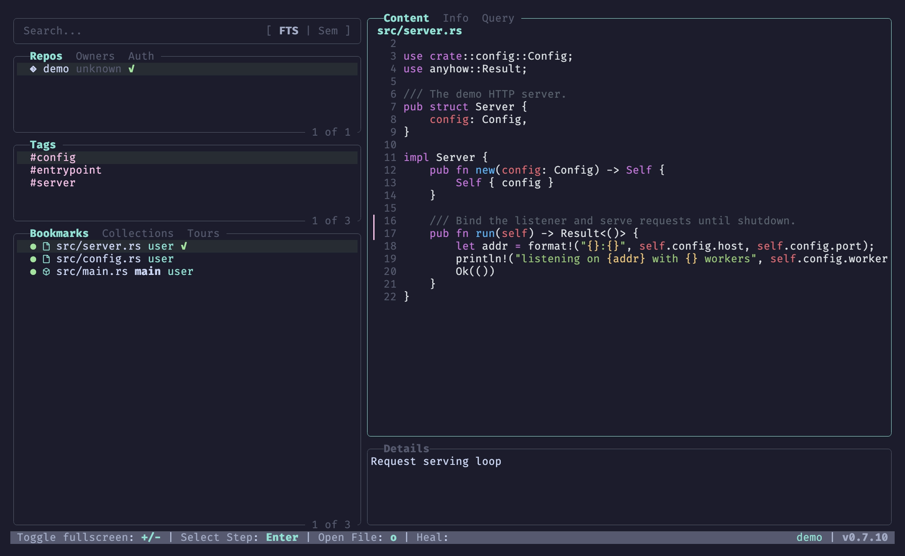
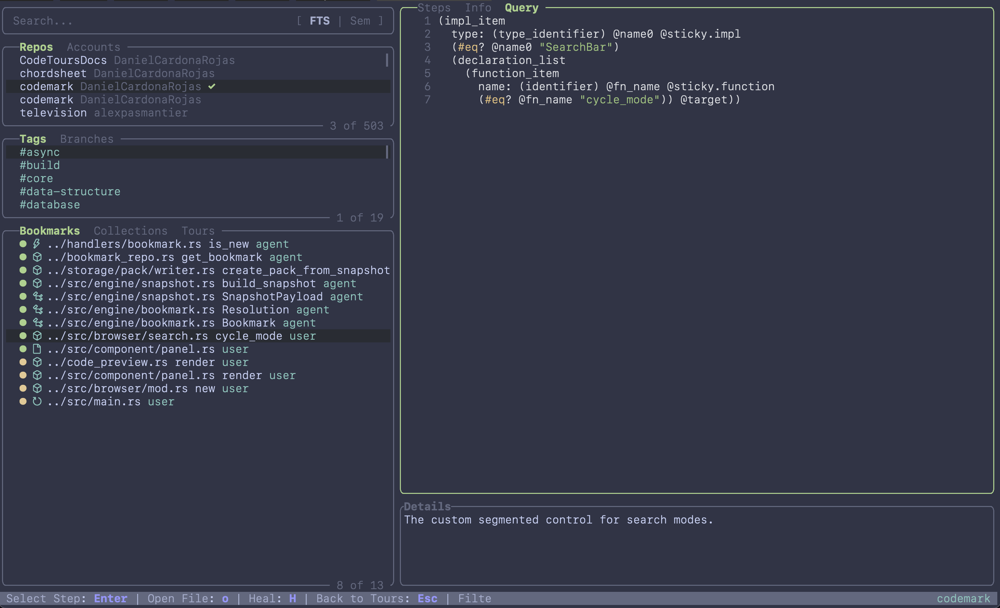
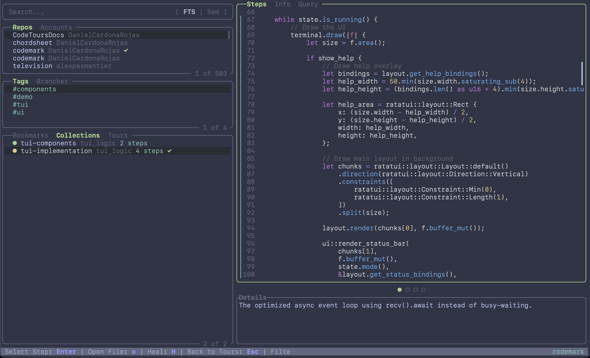

# 🔖 Codemark

[](https://crates.io/crates/codemark)
[](https://github.com/DanielCardonaRojas/codemark/actions/workflows/test.yml)
[](LICENSE)
[](https://www.rust-lang.org)
[](#claude-code)

**Codemark** is a structural bookmarking system for code. Unlike fragile `file:line` references that break when you insert a single newline, Codemark uses **[tree-sitter](https://tree-sitter.github.io/tree-sitter/)** to capture the semantic structure of your code.

Bookmarks **self-heal** across renames, refactors, and formatting changes, making them perfect for long-running AI agent sessions, code audits, and developer knowledge management.

🌐 **Website & docs:** [danielcardonarojas.github.io/codemark](https://danielcardonarojas.github.io/codemark/)

---

## 🚀 Why Codemark?

Standard bookmarks are "dumb"—they point to a coordinate. When the code moves, the coordinate points to the wrong thing. Codemark is "smart"—it knows what you bookmarked (e.g., "the `validateToken` function in `auth.rs`").

- **Self-Healing Resolution**: Tiered matching (Exact → Relaxed → Hash Fallback) ensures your bookmarks stay alive even if the code drifts.
- **Native TUI Dashboard**: A powerful, keyboard-centric command center for managing your code knowledge.
- **Agent Ready**: Designed for AI coding agents (like Claude Code) to maintain context across sessions.
- **Semantic Search**: Find bookmarks by meaning using local vector embeddings (no API key required).

---

## 🖥️ Native Dashboard (TUI)

Codemark features a built-in, keyboard-driven dashboard inspired by `lazygit`. It's the primary interface for managing structural bookmarks, collections, and tours.

```bash
codemark tui
```



| Query preview | Collections |
| --- | --- |
|  |  |

### Dashboard features

- **⌨️ Keyboard-driven, vim-style navigation** — A `lazygit`-like, fully
  keyboard-first interface. Move with `j`/`k` (or arrows), cycle panes with
  `Tab`, switch tabs with `[` / `]`, and resize panes with `+` / `-`. Press `?`
  at any time for a context-aware help overlay.
- **🔄 Push / pull syncing** — Publish collections and tours to a remote
  [codetours](./crates/codetours-server) server with `P` (push), and pull shared
  tours back down with `p`. Share curated walkthroughs across a team.
- **🔍 Semantic & full-text search** — Press `/` to search, then toggle between
  **FTS** (SQLite full-text) and **Semantic** (local vector embeddings) modes.
  FTS finds exact terms; Semantic finds bookmarks by meaning — no API key
  required.
- **📝 Customizable markdown previews** — The details and collection-overview
  panes render through [Handlebars templates](./dev-docs/templates.md). Drop your
  own `details_panel.md` or `codemark_collection_overview.md` into the config
  directory to reshape what's shown.
- **🎨 Colorschemes & themes** — Set `[tui].theme` in your config. Bundled
  options include `OneHalfDark` (default), `Dracula`, `Nord`, `gruvbox-dark`,
  `Solarized`, `Catppuccin Mocha`, and more. Base16/base24 schemes theme both the
  code preview *and* the surrounding UI chrome; drop your own `.tmTheme` or
  base16 `.yaml` files into the `themes/` config subdirectory to add custom ones.
  See [Configuration](./dev-docs/configuration.md).
- **✏️ Open in any editor** — Press `o` on a bookmark to jump straight to the
  code in your configured editor (terminal or GUI). Configure per–file-extension
  commands via the `[open]` config section — see
  [Configuration](./dev-docs/configuration.md).

---

## 🛠️ Features

- 🧠 **Smart Resolution**: Bookmarks survive renames and structural changes.
- 🖥️ **Interactive Dashboard**: Lazygit-style TUI for efficient, keyboard-first interaction.
- 📑 **Rich Metadata**: Captures AST structure, git context, content hashes, and append-only notes/tags.
- 🔍 **Semantic Search**: Find code by intent (e.g., *"where is authentication handled?"*).
- 🗃️ **Collections**: Group bookmarks into logical sets for specific tasks.
- 📦 **Git Integrated**: Track bookmarks across commits and branches.
- 🧩 **First-class Integrations**:
    - **Neovim**: Gut signs, visual selection bookmarking, and Telescope support.
    - **Claude Code**: Specialized plugin for AI-driven bookmarking.

---

## 💻 Installation

### Homebrew (macOS/Linux)
```bash
brew tap DanielCardonaRojas/codemark
brew install codemark
```

### Cargo
```bash
cargo install codemark
```

*Requires Rust 1.75+. SQLite is bundled.*

---

## 🚦 Quick Start

### 1. Install the agent skill
Teach your AI agent how to use Codemark. This installs the Codemark skill into your agent's skills directory:
```bash
codemark install-skill --agent claude --scope user
```

### 2. Let your agent bookmark for you
Ask your agent to capture the structure of your codebase as it explores. For example:

> *"Trace how a request flows from the HTTP router to the database. Create a
> collection called `request-lifecycle` and bookmark each key hop — the route
> handler, the auth middleware, the service layer, and the query builder. Add a
> short note to each explaining its role."*

Your agent will create a collection and add structural bookmarks — complete with
notes and tags — that survive refactors. Later, in a fresh session, you (or
another agent) can reload that context instantly:

> *"Load the `request-lifecycle` collection and walk me through it."*

### 3. Browse with the Dashboard
Launch the keyboard-driven TUI to review and manage what's been captured:
```bash
codemark tui
```

---

## 📖 Documentation

- [**Full Command Reference**](./dev-docs/CLI.md) — Detailed flag and subcommand guide.
- [**Configuration**](./dev-docs/configuration.md) — Editor setup, themes, global/local config, and semantic search.
- [**Templates**](./dev-docs/templates.md) — Customize markdown output and TUI previews.
- [**Neovim Plugin**](./extras/neovim-plugin/README.md) — Setup for `codemark.nvim`.
- [**Claude Code Plugin**](./extras/claude-code-plugin/) — Power up your AI agent.

---

## 🎨 Customizing Markdown Output

Codemark formats command output and TUI previews with [Handlebars](https://handlebarsjs.com/) templates. Override the default for `codemark show` (and the TUI panes) by dropping your own template in the config directory:

```bash
mkdir -p ~/.config/codemark/templates
cp ./templates/codemark_show.md ~/.config/codemark/templates/
$EDITOR ~/.config/codemark/templates/codemark_show.md
```

For the full template specification — every available variable, loops,
conditionals, helpers, and the default templates — see the
**[Templates reference](./dev-docs/templates.md)**.

---

## 🎨 Supported Languages

Codemark speaks AST for:
- 🦀 **Rust**
- 🍎 **Swift**
- 🔷 **TypeScript / TSX**
- 🐍 **Python**
- 🐹 **Go**
- ☕ **Java**
- 🎯 **Dart**
- ♯ **C#**

---

## 🏗️ Built With

Codemark is a **local-first** Rust workspace — no cloud service, account, or API
key is required for any core feature.

| Layer | Technology |
|-------|------------|
| **Language** | [Rust](https://www.rust-lang.org) (workspace: `codemark-core`, `codemark-cli`, `codemark-tui`, `codetours-server`) |
| **Structural parsing** | [tree-sitter](https://tree-sitter.github.io/tree-sitter/) |
| **Storage** | [SQLite](https://www.sqlite.org) via `rusqlite` (bundled), with [`sqlite-vec`](https://github.com/asg017/sqlite-vec) for vector search and FTS5 for full-text search |
| **Embeddings** | Local models run on [`candle`](https://github.com/huggingface/candle) — semantic search with no API key |
| **TUI** | [`ratatui`](https://ratatui.rs) + `crossterm`, with [`syntect`](https://github.com/trishume/syntect) syntax highlighting |
| **Templating** | [Handlebars](https://handlebarsjs.com/) |
| **Sync server** | [`axum`](https://github.com/tokio-rs/axum) + `tokio`, JWT auth (the `codetours` server) |
| **Git integration** | [`git2`](https://github.com/rust-lang/git2-rs) (libgit2) |

---

## 🛡️ License

Released under the [MIT License](LICENSE).
