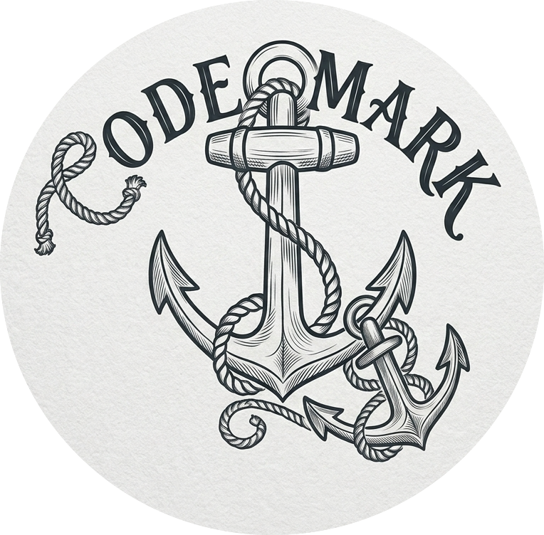
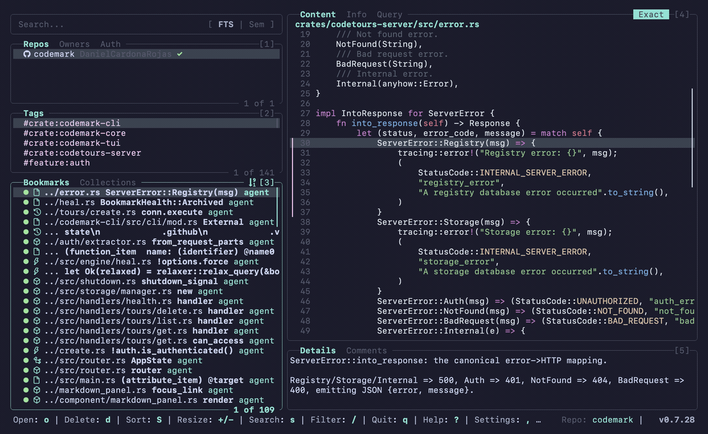
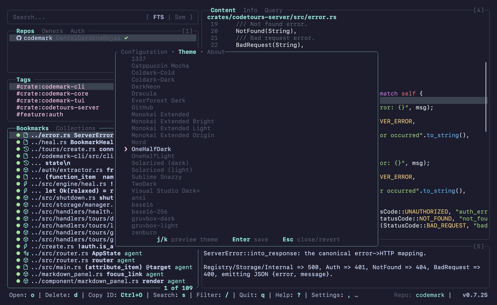
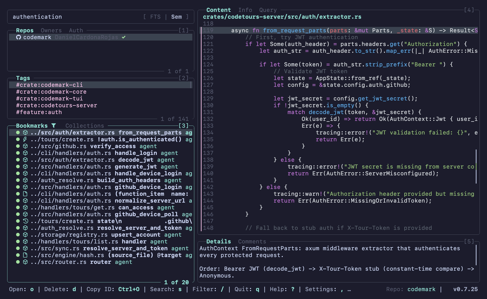
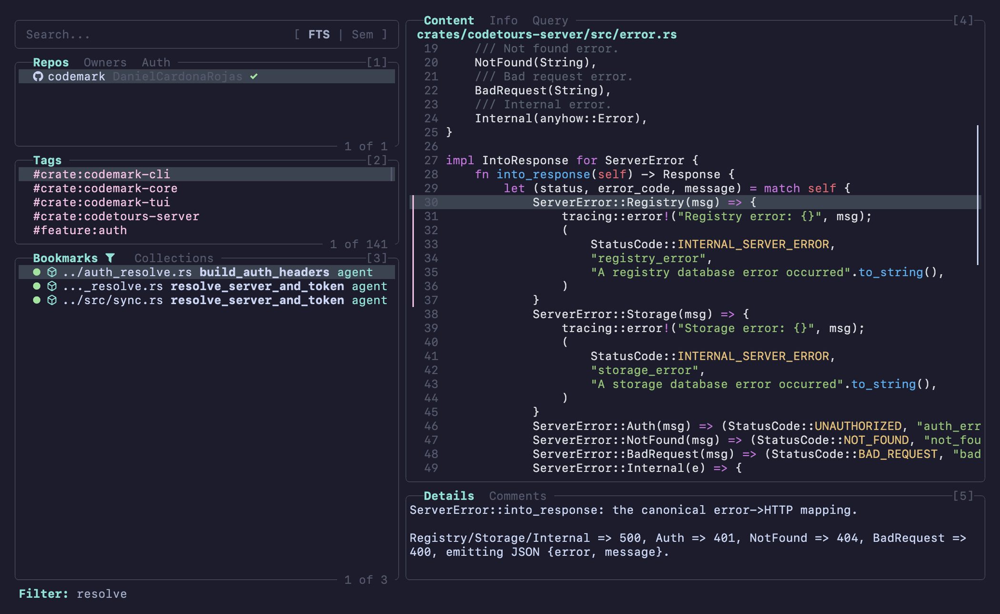
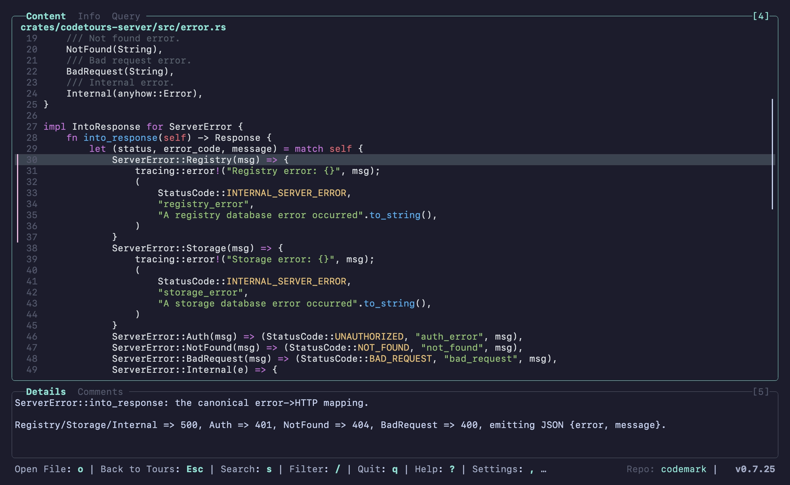
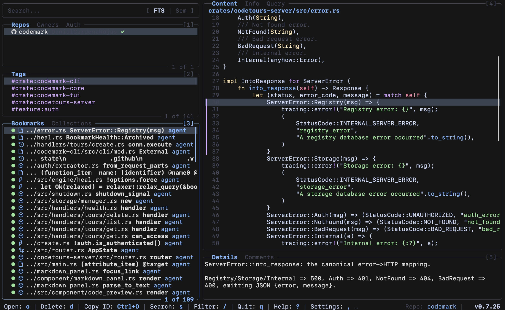
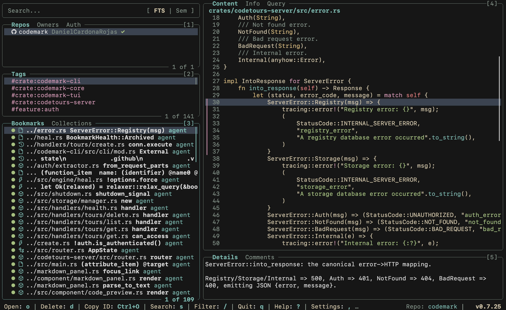

<div align="center">
  <picture>
    <source media="(prefers-color-scheme: dark)" srcset="codemark_dark_logo.png">
    <source media="(prefers-color-scheme: light)" srcset="codemark_light_logo.png">
    
  </picture>
</div>

<div align="center">

[](https://github.com/DanielCardonaRojas/codemark/releases/latest)
[](https://github.com/DanielCardonaRojas/codemark/actions/workflows/test.yml)
[](LICENSE)
[](https://www.rust-lang.org)
[](#-use-it-with-your-agent)

**Native on**
&nbsp;<a href="#-installation"><picture><source media="(prefers-color-scheme: dark)" srcset="docs/install/apple.svg"></picture></a>
&nbsp;<a href="#-installation"><picture><source media="(prefers-color-scheme: dark)" srcset="docs/install/linux.svg"></picture></a>
&nbsp;<a href="#-installation"><picture><source media="(prefers-color-scheme: dark)" srcset="docs/install/windows.svg"></picture></a>

</div>

**Codemark** bookmarks code by structure, not by line number. A `file:line`
reference breaks the moment you add a newline above it; Codemark uses
[tree-sitter](https://tree-sitter.github.io/tree-sitter/) to remember *what* you
marked (a function, a block, a type) and anchors the bookmark to that named
structure, so it still points at the right place after you refactor or reformat
around it.

That durability is what makes it useful for long agent sessions, code audits, and
keeping track of things you want to find again.

---

## 📑 Table of Contents

- [Use It With Your Agent](#-use-it-with-your-agent)
- [Native Dashboard (TUI)](#-native-dashboard-tui)
- [Features](#-features)
- [Installation](#-installation)
- [Quick Start](#-quick-start)
- [Supported Languages](#-supported-languages)
- [Customizing Markdown Output](#-customizing-markdown-output)
- [Documentation](#-documentation)
- [Built With](#-built-with)
- [License](#-license)

---

## ⚡ Use It With Your Agent

Codemark ships with a skill you can install into your coding agent. Once it's in,
the agent knows how to create and recall structural bookmarks on its own, so the
context it built up in one session is still there in the next, instead of being
rebuilt from scratch every time.

```bash
codemark install-skill --agent claude --scope user
```

Then just ask, in any session:

> *"Trace how a request flows from the HTTP router to the database. Create a
> collection called `request-lifecycle` and bookmark each key hop: the route
> handler, the auth middleware, the service layer, and the query builder. Add a
> short note to each explaining its role."*

Later, in a fresh session and even after the code has moved around, you or another
agent can pick the context back up:

> *"Load the `request-lifecycle` collection and walk me through it."*

The bookmarks are structural, so they still resolve once the underlying code has
changed. Works with **Claude Code**, **GitHub Copilot**, **Gemini CLI**, and any
agent that loads `.agents/skills`.

### What you can ask for

Once a flow lives in a collection, anyone can reuse it: you, a teammate, or the
next agent session:

- 🧭 **Onboard a new engineer**
  > *"Load the `request-lifecycle` collection and give me a guided tour of how
  > this service handles a request, in the order the code runs."*
- 🔎 **Explain a code flow**
  > *"Bookmark the steps of the checkout flow into a `checkout` collection, then
  > summarize what each step is responsible for."*
- 🐞 **Hunt a bug in a known flow**
  > *"There's a bug where expired tokens are still accepted. Read the `auth-flow`
  > collection and tell me which hop is most likely responsible."*
- 🔗 **Relate two flows**
  > *"Compare the `request-lifecycle` and `background-jobs` collections. Where do
  > they share code or state, and where could they conflict?"*

📘 Walkthrough: [**Agent Workflow Guide**](./dev-docs/guides/agent-workflow-walkthrough.md) · [**Agent Skill source**](./extras/skills/codemark/SKILL.md)

---

## 🖥️ Native Dashboard (TUI)

Codemark comes with a keyboard-driven dashboard in the style of `lazygit`. It's
the main way to browse and manage bookmarks, collections, and tours by hand.

```bash
codemark tui
```

> **Requires a [Nerd Font](https://www.nerdfonts.com/).** The dashboard uses glyph
> icons throughout, so set your terminal to a Nerd Font (e.g. `JetBrainsMono Nerd
> Font`) so they render correctly instead of showing as `□` placeholders.



#### 🎬 More demos

<table>
  <tr>
    <td align="center" width="240">
      <a href="./dev-docs/guides/demo-gallery.md#settings">
        
        <br><sub><b>Settings overlay</b></sub>
      </a>
    </td>
    <td align="center" width="240">
      <a href="./dev-docs/guides/demo-gallery.md#search--full-text--semantic">
        
        <br><sub><b>FTS &amp; semantic search</b></sub>
      </a>
    </td>
    <td align="center" width="240">
      <a href="./dev-docs/guides/demo-gallery.md#filtering-pane-contents">
        
        <br><sub><b>Filter pane contents</b></sub>
      </a>
    </td>
    <td align="center" width="240">
      <a href="./dev-docs/guides/demo-gallery.md#resizing--cycling-layouts">
        
        <br><sub><b>Resize &amp; cycle layouts</b></sub>
      </a>
    </td>
  </tr>
</table>

See the [**Demo Gallery**](./dev-docs/guides/demo-gallery.md) for the full-size animated walkthroughs.

### Themes

The TUI ships with built-in color schemes that re-theme the whole interface. Set
one in your config (`tui.theme`) or via the `CODEMARK_TUI_THEME` environment
variable; run `codemark-tui --list-schemes` to see what's available.

| Catppuccin Mocha | Everforest Dark |
| --- | --- |
|  |  |

### Dashboard features

- **⌨️ Keyboard-driven, vim-style navigation** A `lazygit`-like, fully
  keyboard-first interface. Move with `j`/`k` (or arrows), cycle panes with
  `Tab`, switch tabs with `[` / `]`, and resize panes with `+` / `-`. Press `?`
  at any time for a context-aware help overlay.
- **🔄 Push / pull syncing** Publish collections and tours to a remote
  [codetours](./crates/codetours-server) server with `P` (push), and pull shared
  tours back down with `p`. Share curated walkthroughs across a team.
- **🔍 Semantic & full-text search** Press `/` to search, then toggle between
  **FTS** (SQLite full-text) and **Semantic** (local vector embeddings) modes.
  FTS finds exact terms; Semantic finds bookmarks by meaning, with no API key
  required.
- **📝 Customizable markdown previews** The details and collection-overview
  panes render through [Handlebars templates](./dev-docs/templates.md). Drop your
  own `details_panel.md` or `codemark_collection_overview.md` into the config
  directory to reshape what's shown.
- **🎨 Colorschemes & themes** Set `[tui].theme` in your config. Bundled
  options include `OneHalfDark` (default), `Dracula`, `Nord`, `gruvbox-dark`,
  `Solarized`, `Catppuccin Mocha`, and more. Base16/base24 schemes theme both the
  code preview *and* the surrounding UI chrome; drop your own `.tmTheme` or
  base16 `.yaml` files into the `themes/` config subdirectory to add custom ones.
  See [Configuration](./dev-docs/configuration.md).
- **✏️ Open in any editor** Press `o` on a bookmark to jump straight to the
  code in your configured editor (terminal or GUI). Configure per–file-extension
  commands via the `[open]` config section; see
  [Configuration](./dev-docs/configuration.md).

---

## 🛠️ Features

- 🧠 **Smart Resolution**: Queries are anchored to named structures and survive refactoring and reformatting via tiered matching (Exact → Relaxed → Hash Fallback).
- 🖥️ **Interactive Dashboard**: Lazygit-style TUI for efficient, keyboard-first interaction.
- 📑 **Rich Metadata**: Captures AST structure, git context, content hashes, and append-only notes/tags.
- 🔍 **Semantic Search**: Find code by intent (e.g., *"where is authentication handled?"*) with local embeddings, no API key.
- 🗃️ **Collections**: Group bookmarks into logical sets for specific tasks.
- 📦 **Git Integrated**: Track bookmarks across commits and branches.
- 🧩 **Agent Skills**: An installable skill that teaches AI coding agents to bookmark for you. Works with Claude Code, GitHub Copilot, Gemini CLI, and any agent that loads `.agents/skills`.

---

## 💻 Installation

Prebuilt binaries are published for **macOS** (Apple Silicon & Intel), **Linux** (x86_64, glibc), and **Windows** (x86_64). Choose whichever method you prefer.

### Homebrew (macOS / Linux)
```bash
brew install DanielCardonaRojas/codemark/codemark
```

### Install script (macOS / Linux)
```bash
curl --proto '=https' --tlsv1.2 -LsSf https://github.com/DanielCardonaRojas/codemark/releases/latest/download/codemark-cli-installer.sh | sh
```

### PowerShell (Windows)
```powershell
powershell -ExecutionPolicy Bypass -c "irm https://github.com/DanielCardonaRojas/codemark/releases/latest/download/codemark-cli-installer.ps1 | iex"
```

### mise
```bash
mise use -g github:DanielCardonaRojas/codemark
```

### Cargo (build from source)
```bash
cargo install --git https://github.com/DanielCardonaRojas/codemark codemark-cli
```
*Requires Rust 1.85+ (edition 2024). SQLite is bundled.*

> The script, PowerShell, and `mise` methods install prebuilt binaries from the [GitHub releases](https://github.com/DanielCardonaRojas/codemark/releases). You can also download a platform archive there directly.

### Terminal UI (optional)
`codemark tui` opens the interactive dashboard, a separate companion binary. **Homebrew installs it automatically** alongside the CLI. The other prebuilt methods (script, PowerShell, mise) install the `codemark` CLI only; add the dashboard with:
```bash
cargo install --git https://github.com/DanielCardonaRojas/codemark codemark-tui
```

---

## 🚦 Quick Start

> **Repo-aware by default.** Codemark automatically detects the current Git
> repository (walking up from your working directory) and stores bookmarks
> alongside it, with no setup required. You can also operate on a repo from any path
> by referencing it by identity with `--repo <owner/name>`, or point at a
> specific database with `--db <path>` / the `CODEMARK_DB` env var.

Prefer to drive it yourself instead of through an agent? The CLI is all you need.

### 1. Bookmark a range
```bash
codemark add --file src/auth.rs --range 42-67 --tag auth --note "token validation entrypoint"
```

### 2. Find it again, even after the code moves
```bash
codemark list                 # see everything you've marked
codemark resolve <id>         # re-locate a single bookmark
codemark search "auth"        # full-text + semantic search
```

### 3. Browse with the dashboard
```bash
codemark tui
```

See the [**Full Command Reference**](./dev-docs/CLI.md) for every subcommand and flag, including collections, tours, snippet matching, and multi-repo queries.

---

## 🌐 Supported Languages

Codemark speaks AST for:
- 🦀 **Rust**
- 🍎 **Swift**
- 🔷 **TypeScript / TSX**
- 🐍 **Python**
- 🐹 **Go**
- ☕ **Java**
- 🎯 **Dart**
- ♯ **C#**

---

## 🎨 Customizing Markdown Output

Codemark formats command output and TUI previews with [Handlebars](https://handlebarsjs.com/) templates. Override the default for `codemark show` (and the TUI panes) by dropping your own template in the config directory:

```bash
mkdir -p ~/.config/codemark/templates
cp ./templates/codemark_show.md ~/.config/codemark/templates/
$EDITOR ~/.config/codemark/templates/codemark_show.md
```

For the full template specification, covering every available variable, loops,
conditionals, helpers, and the default templates, see the
**[Templates reference](./dev-docs/templates.md)**.

---

## 📖 Documentation

- [**Full Command Reference**](./dev-docs/CLI.md): Detailed flag and subcommand guide.
- [**Configuration**](./dev-docs/configuration.md): Editor setup, themes, global/local config, and semantic search.
- [**Templates**](./dev-docs/templates.md): Customize markdown output and TUI previews.
- [**Agent Workflow Guide**](./dev-docs/guides/agent-workflow-walkthrough.md): End-to-end walkthrough of using Codemark with an AI agent.
- [**Agent Skill**](./extras/skills/codemark/SKILL.md): The skill installed by `codemark install-skill` (Claude Code, Copilot, Gemini, and more).

---

## 🏗️ Built With

Codemark is a **local-first** Rust workspace. No cloud service, account, or API
key is required for any core feature.

| Layer | Technology |
|-------|------------|
| **Language** | [Rust](https://www.rust-lang.org) (workspace: `codemark-core`, `codemark-cli`, `codemark-tui`, `codetours-server`) |
| **Structural parsing** | [tree-sitter](https://tree-sitter.github.io/tree-sitter/) |
| **Storage** | [SQLite](https://www.sqlite.org) via `rusqlite` (bundled), with [`sqlite-vec`](https://github.com/asg017/sqlite-vec) for vector search and FTS5 for full-text search |
| **Embeddings** | Local models run on [`candle`](https://github.com/huggingface/candle) for semantic search with no API key |
| **TUI** | [`ratatui`](https://ratatui.rs) + `crossterm`, with [`syntect`](https://github.com/trishume/syntect) syntax highlighting |
| **Markdown** | [`pulldown-cmark`](https://github.com/pulldown-cmark/pulldown-cmark) renders the details and collection-overview previews |
| **Templating** | [Handlebars](https://handlebarsjs.com/) |
| **Sync server** | [`axum`](https://github.com/tokio-rs/axum) + `tokio`, JWT auth (the `codetours` server) |
| **Git integration** | [`git2`](https://github.com/rust-lang/git2-rs) (libgit2) |

---

## 🛡️ License

Released under the [MIT License](LICENSE).
