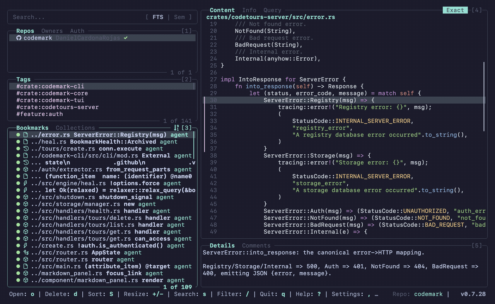

# Demo Gallery

Animated walkthroughs of the Codemark TUI. They live here instead of inline in the
README because each GIF is full-resolution and runs to several megabytes.

Every clip is recorded from the real binary against this repo's own knowledge
base. See [screenshots/README.md](../../screenshots/README.md) if you want to
regenerate them.

---

## Guided tour

Move through bookmarks with the arrow keys, flip between the Content / Info /
Query preview tabs, then open a collection and step through it.

---

## Settings

Press `,` to open the Settings overlay, then move across its tabs with `]` / `[`
(Configuration → Theme → About). The Theme tab previews each color scheme as you
scroll through it with `j` / `k`.

---

## Search — full-text & semantic

Press `s` to focus the search bar, type a query, and hit `Enter` to run it. `Ctrl+S`
switches between two modes: **FTS** (SQLite full-text, matches exact terms) and
**Semantic** (local vector embeddings, matches by meaning, no API key). Semantic
mode handles intent-style questions like *"where do we resolve a bookmark after the
code moves"*; it's slower, so you'll see a brief loading spinner. Double `Esc`
clears the search.

---

## Filtering pane contents

This is separate from search. Press `/` to filter the **focused pane's** visible
list; it narrows as you type, no `Enter` needed. Each pane keeps its own filter —
the Bookmarks pane and the Tags pane don't share one — and `Esc` clears the
active filter.

---

## Resizing & cycling layouts

The dashboard isn't a fixed three-pane grid. Focus a pane with its number key
(`1`–`5`), then grow it with `+` and shrink it with `-`. The preview and details
panes cycle through their own sizes on each press, so you can go from the default
split to a full-width preview and back without touching your mouse.

- `4` focuses the preview pane; `+` cycles it through full-width and
  preview-only, then back to the regular split.
- `5` focuses the details pane; `+` grows it to fill the right side, then the
  whole screen.
- `3` focuses the bookmarks pane; `+` widens the left side until it takes over the
  window.

