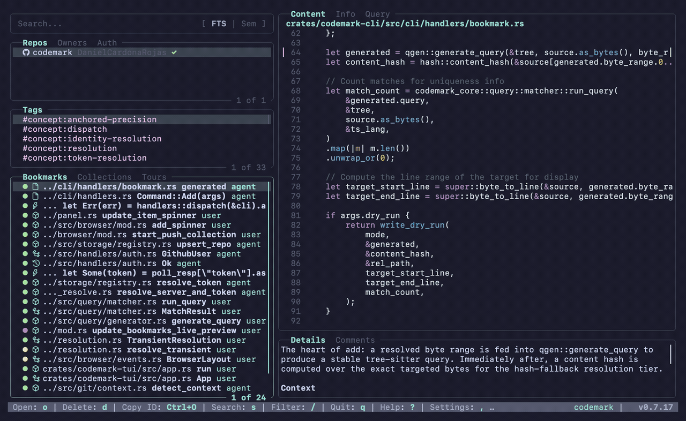
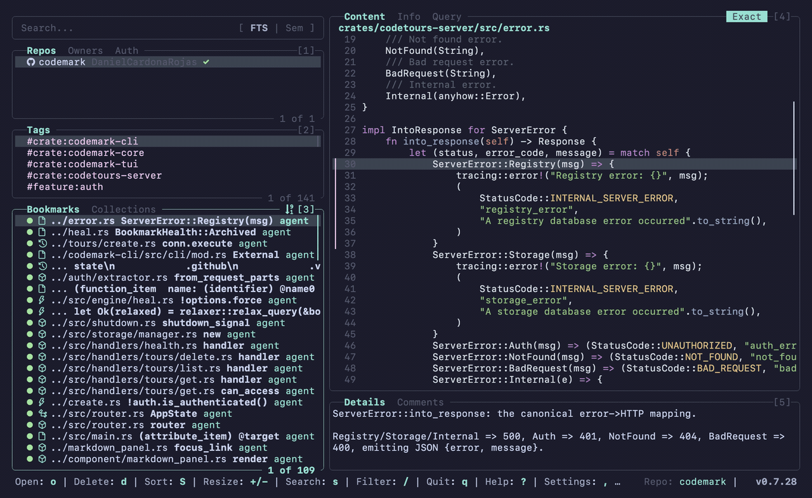
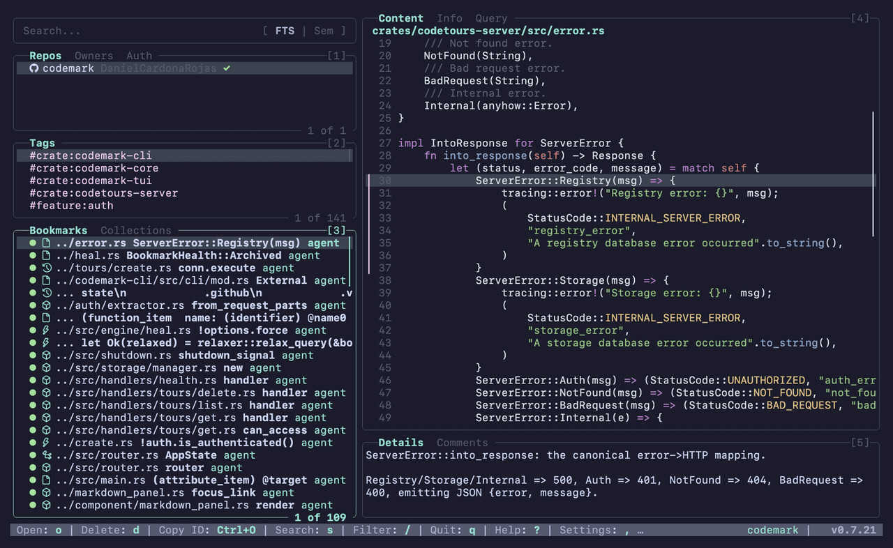

# Demo Gallery

Animated walkthroughs of the Codemark TUI. These live here (rather than inline in
the README) so the README stays light — each demo GIF is full-resolution and
several megabytes.

All clips are generated from the live binary against this repo's own knowledge
base; see [screenshots/README.md](../../screenshots/README.md) for how to
regenerate them.

---

## Guided tour

Browse bookmarks with the arrow keys, inspect the Content / Info / Query preview
tabs, open a collection, and step through it.

---

## Settings

Open the Settings overlay with `,`, then cycle its tabs with `]` / `[`
(Configuration → Theme → About). The Theme tab live-previews each color scheme
as you move through it with `j` / `k`.

---

## Search — full-text & semantic

Press `s` to focus the search bar, type a query, and press `Enter` to run it.
Toggle between **FTS** (SQLite full-text, exact terms) and **Semantic** (local
vector embeddings, by meaning — no API key) with `Ctrl+S`. Semantic mode answers
intent-style queries like *"where do we resolve a bookmark after the code moves"*
(it's slower, so it shows a brief loading spinner). Clear a search with double
`Esc`.

---

## Filtering pane contents

Distinct from search: press `/` to filter the **focused pane's** visible list,
narrowing it live as you type (no `Enter` needed). Filters are pane-scoped — the
Bookmarks pane and the Tags pane each keep their own — and `Esc` clears the
active filter.

