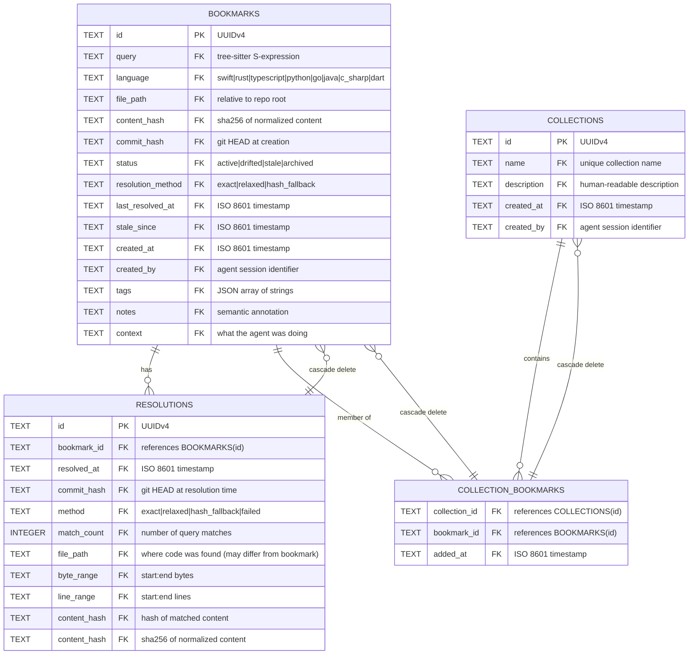

# Database Schema

Codemark uses SQLite as its storage backend. The database is located at `.codemark/codemark.db` relative to the git repository root.

## Entity Relationship Diagram



## Table Details

### bookmarks

The core table storing bookmark metadata and the tree-sitter query used to re-find the code.

| Column | Type | Description |
|--------|------|-------------|
| `id` | TEXT PRIMARY KEY | UUIDv4 identifier |
| `query` | TEXT NOT NULL | Tree-sitter S-expression query |
| `language` | TEXT NOT NULL | Programming language |
| `file_path` | TEXT NOT NULL | Relative path from repo root |
| `content_hash` | TEXT | SHA-256 of normalized content (64-bit) |
| `commit_hash` | TEXT | Git HEAD at creation time |
| `status` | TEXT NOT NULL | `active`, `drifted`, `stale`, or `archived` |
| `resolution_method` | TEXT | Last resolution method: `exact`, `relaxed`, `hash_fallback` |
| `last_resolved_at` | TEXT | ISO 8601 timestamp of last resolution |
| `stale_since` | TEXT | ISO 8601 timestamp when first marked stale |
| `created_at` | TEXT NOT NULL | ISO 8601 creation timestamp |
| `created_by` | TEXT | Agent or user identifier |
| `tags` | TEXT | JSON array: `["tag1", "tag2"]` |
| `notes` | TEXT | Semantic annotation |
| `context` | TEXT | What the agent was doing when bookmarking |

**Indexes:**
- `idx_bookmarks_status` on `status`
- `idx_bookmarks_file` on `file_path`
- `idx_bookmarks_language` on `language`

### resolutions

Audit trail of where bookmarks were found over time. Records are pruned based on `max_resolutions_per_bookmark` config.

| Column | Type | Description |
|--------|------|-------------|
| `id` | TEXT PRIMARY KEY | UUIDv4 identifier |
| `bookmark_id` | TEXT NOT NULL | Foreign key to bookmarks |
| `resolved_at` | TEXT NOT NULL | ISO 8601 timestamp |
| `commit_hash` | TEXT | Git HEAD at resolution time |
| `method` | TEXT NOT NULL | `exact`, `relaxed`, `hash_fallback`, or `failed` |
| `match_count` | INTEGER | Number of query matches (for debugging) |
| `file_path` | TEXT | Where code was found (may differ from bookmark) |
| `byte_range` | TEXT | Byte range as `start:end` |
| `line_range` | TEXT | Line range as `start:end` |
| `content_hash` | TEXT | Hash of matched content |

**Deduplication:** A new resolution is considered a duplicate if an existing resolution has the same `byte_range`, `line_range`, and `method`. When a duplicate is detected, the existing resolution's `commit_hash` and `resolved_at` are updated instead of creating a new entry.

**Indexes:**
- `idx_resolutions_bookmark` on `bookmark_id`
- `idx_resolutions_resolved` on `resolved_at`

### collections

Named groups of bookmarks for organizing related code.

| Column | Type | Description |
|--------|------|-------------|
| `id` | TEXT PRIMARY KEY | UUIDv4 identifier |
| `name` | TEXT NOT NULL UNIQUE | Collection name |
| `description` | TEXT | Human-readable description |
| `created_at` | TEXT NOT NULL | ISO 8601 creation timestamp |
| `created_by` | TEXT | Agent or user identifier |

**Indexes:**
- `idx_collections_name` on `name`

### collection_bookmarks

Many-to-many relationship between collections and bookmarks. Maintains insertion order via `added_at`.

| Column | Type | Description |
|--------|------|-------------|
| `collection_id` | TEXT NOT NULL | Foreign key to collections |
| `bookmark_id` | TEXT NOT NULL | Foreign key to bookmarks |
| `added_at` | TEXT NOT NULL | ISO 8601 timestamp |

**Primary Key:** `(collection_id, bookmark_id)`

**Indexes:**
- `idx_cb_bookmark` on `bookmark_id`

## Cascade Deletion

- When a bookmark is deleted, all its resolutions are automatically deleted
- When a collection is deleted, all `collection_bookmarks` entries are deleted
- When a bookmark is deleted, all `collection_bookmarks` references are deleted

## Deduplication Strategy

Resolutions are deduplicated based on the code location, not the commit:

```sql
-- A duplicate is detected when all three match:
byte_range = "806:3337"
line_range = "27:102"
method = "exact"
```

When a duplicate is detected:
- The existing resolution's `commit_hash` and `resolved_at` are **updated**
- No new row is inserted
- This keeps the resolution history clean while maintaining accurate metadata

This means if you heal a bookmark at commit A, then make an unrelated change at commit B and heal again, you'll have one resolution entry (updated with commit B's info) rather than two redundant entries.
