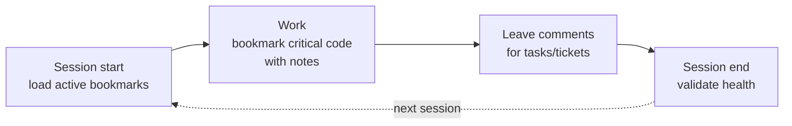

# The Agent Skill

Codemark ships with an installable skill that teaches your coding agent to create
and recall structural bookmarks on its own. The context it builds in one session
is still there in the next — so you **stop struggling to find the code you and
your agent have already discovered**, and can **leave targeted comments** for the
next agent to pick up exactly where the last one left off.

Works with **Claude Code**, **GitHub Copilot**, **Gemini CLI**, and any agent
that loads `.agents/skills`.

## Install

```bash
codemark install-skill --agent claude --scope user
```

Use `--scope project` to install it into a single repo (committed in
`.agents/skills`), or `--scope user` for every project.

::: tip Author identity
When the agent creates bookmarks it identifies itself with `--created-by`
(`claude`, `copilot`, `gemini`, `pi`). You can then filter by author —
`codemark list --author claude` — to see exactly what each agent contributed.
:::

## How the agent discovers bookmarks

Once the skill is installed, the agent searches intelligently rather than
re-reading files. In priority order:

| Strategy | When the agent uses it |
|----------|------------------------|
| **Semantic search** | Natural-language or conceptual queries — *"where is auth handled?"* |
| **Tag filtering** | Specific concepts or layers — `--tag feature:auth --health active` |
| **File-aware search** | Discussing a specific module — `--file src/auth.rs` |
| **Collection browsing** | Loading a whole flow — `codemark tour show <name> --format markdown` |
| **Hybrid** | Combine semantic search with filters — `search "middleware" --health active --collection auth-flow` |

## Creating bookmarks

The agent always targets by range first (most reliable), with snippet- and
query-based fallbacks for precision. The recommended pattern is to add bookmarks
**directly into a collection** with focused notes:

```bash
# Preferred: range-based, multiple focused notes, into a collection
codemark add --file src/auth.rs --range 42 \
  --note "Core auth entry point — all signed requests pass through here" \
  --note "Verifies JWT signature and expiry" \
  --collection login-flow --created-by claude

# Snippet-based (when only the code is known, not the range)
echo 'func validateToken' | codemark add --file src/auth.swift --snippet \
  --note "Validates JWT tokens" --collection login-flow

# Raw tree-sitter query (extreme precision / disambiguation)
codemark add --file src/auth.swift \
  --query '(function_declaration name: (simple_identifier) @name (#eq? @name "validateToken")) @target' \
  --note "Token validation function" --collection login-flow
```

## Notes vs. comments — two channels

Every bookmark has two distinct, durable-vs-ephemeral channels. Using them
correctly is what lets you **provide targeted comments for AI agents** without
polluting the durable explanations:

| Channel | Flag | Format | Lifetime | Use for |
|---------|------|--------|----------|---------|
| **Notes** | `--note` | plain prose | durable, reusable | *What the code is and why it matters* — context-independent. |
| **Comments** | `--comment` | **markdown** | task/session-scoped | Discussion tied to a task, ticket, or PR — links, lists, code blocks. |

```bash
# Durable note (reusable across any session) + targeted markdown comment
codemark add --file src/auth.rs --range 42 \
  --note "Validates the session cookie before any handler runs" \
  --comment "Touched for **ENG-42** (session fixation). See [PR #128](https://github.com/org/repo/pull/128); needs a regression test." \
  --created-by claude

# Add a follow-up comment later without disturbing the notes
codemark edit <id> --comment "Confirmed fixed by rotating the session id on login. Closing ENG-42."
```

Each `--note` creates a **separate** annotation entry, so multiple agents can
layer context over time — document behavior, performance, and security as
independent notes, and add more later without editing prior ones.

## Tag taxonomy

Structured, colon-prefixed tags power precise filtering. Apply multiple when
creating a bookmark (the `add`/`edit`/`annotate` commands all accept repeated
`--tag`):

| Prefix | Example | Meaning |
|--------|---------|---------|
| `feature:` / `domain:` | `feature:auth` | Feature or domain area |
| `layer:` | `layer:api` | Architectural layer (`api`/`business`/`data`/`infra`/`ui`/`config`) |
| `role:` | `role:entrypoint` | Responsibility (`entrypoint`/`handler`/`service`/`repository`/`middleware`/`validator`/`error`/…) |
| `type:` | `type:function` | Code-element kind (`function`/`class`/`interface`/`enum`/…) |
| `task:` / `pr:` / `issue:` | `task:fix-123` | Linked work item |
| `security:` | `security:auth` | Security-sensitive code |
| `module:` / `crate:` / `package:` | `crate:auth` | Module/package context (per-language) |

::: warning Filtering is single-tag
`list --tag` matches **one** tag at a time — combine it with `--health`,
`--author`, `--lang`, or `--collection`. To narrow by several concepts at once,
use semantic search instead (which has `--lang`/`--author`/`--health`/`--collection`
filters but no `--tag`).
:::

### Recommended combinations

```bash
# Auth entry point
--tag feature:auth --tag layer:api --tag role:entrypoint --tag security:auth

# Database query
--tag feature:users --tag layer:data --tag role:repository

# Configuration
--tag layer:config --tag role:constant
```

## Example prompts

### Remember a flow
> *"Trace how a request flows from the HTTP router to the database. Create a
> collection called `request-lifecycle` and bookmark each key hop. Add a note to
> each explaining its role."*

### Recall it later
> *"Load the `request-lifecycle` collection and walk me through it."*

### Onboard
> *"Load the `request-lifecycle` collection and give me a guided tour of how this
> service handles a request, in the order the code runs."*

### Hunt a bug with targeted context
> *"There's a bug where expired tokens are still accepted. Read the `auth-flow`
> collection and tell me which hop is most likely responsible. Bookmark anything
> suspicious with a comment for the next session."*

### Relate two flows
> *"Compare the `request-lifecycle` and `background-jobs` collections. Where do
> they share code or state, and where could they conflict?"*

## Session lifecycle



- **Start**: `codemark list --health active` to restore context.
- **During**: bookmark entry points, boundaries, error paths — what you'd want to
  know if starting over tomorrow.
- **End**: `codemark health check --auto-archive` so the next session starts with
  accurate references.
