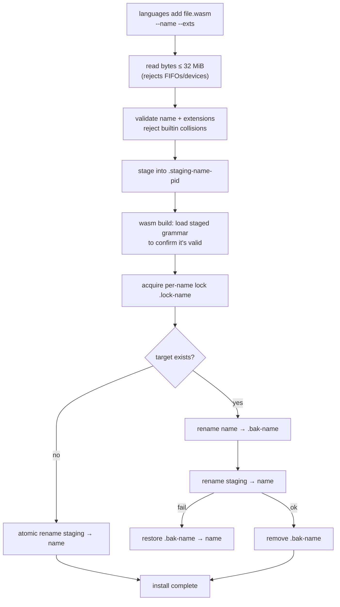

# Dynamic Tree-sitter Grammars

Codemark supports 8 languages built in (Rust, Swift, TypeScript/TSX, Python, Go,
Java, Dart, C#), and **any other language** via dynamic WASM grammar loading —
no recompilation needed. This page covers how it works in
`crates/codemark-core/src/grammar/` and `parser/registry.rs`.

## How it works

Built-in languages are statically compiled into the binary. Dynamic languages
are WASM grammars loaded at runtime from a cache directory. A single
process-global [wasmtime](https://wasmtime.dev/) `Engine` backs all WASM stores.
Built-ins **always win**: the registry refuses to register a name or extension
already claimed by a built-in.

## Cache location

`global_grammars_dir()`: `$CODEMARK_GRAMMARS_DIR` → `cache_dir/codemark/grammars`.

| Platform | Path |
|----------|------|
| macOS | `~/Library/Caches/codemark/grammars/` |
| Linux | `~/.cache/codemark/grammars/` |
| Windows | `%LOCALAPPDATA%\codemark\cache\grammars\` |

Layout: `<cache>/<lang>/grammar.wasm` + `<cache>/<lang>/manifest.json`.

## The manifest

```json
{
  "name": "lua",
  "version": "0.1.0",
  "extensions": ["lua", "luau"],
  "profile": {
    "landmark_kinds": ["function_declaration", "function_definition"],
    "node_labels": { "function_declaration": "function" },
    "containers": [["function_declaration", "name"]]
  }
}
```

The `profile` is optional (omitting it writes `{}`). Every field is
`#[serde(default)]`, so partial profiles work — but a `landmark_kinds` with the
right node types is what makes bookmarks anchor correctly for a new language.
See [Query Generation](./query-generation) for what landmarks do.

## Installing a grammar

```bash
codemark languages add path/to/grammar.wasm --name lua --extensions lua,luau
```

`--name` and `--extensions` let you override what the manifest declares. The
install is **hardened** — it never lets an unloadable grammar replace a working
one:



Key safety properties:

- **Stage-then-swap.** The grammar is written to a staging dir, validated, then
  swapped in atomically.
- **Pre-swap validation.** On WASM builds, the staged grammar is loaded *before*
  the swap — an unloadable file can never replace a working one.
- **Anti-symlink writes.** Files are written with `O_NOFOLLOW` (Unix) /
  reparse-point handling (Windows) to block symlink-redirect attacks.
- **32 MiB cap.** Grammar files larger than 32 MiB are rejected.
- **Crash recovery.** If an install is interrupted, the next process start
  restores any `.bak-<name>` whose target is missing — so a killed installer
  can't leave you with a missing grammar.

## Discovery at startup

On first access, the global registry scans the cache dir, sorts entries by path
(deterministic conflict resolution — first by sorted path wins), skips
dot-prefixed staging/backup/lock files, parses each `manifest.json`, and
registers by lowercased name + extension. The TUI re-scans on events so newly
installed grammars appear without a restart.

## Managing grammars

| Command | Effect |
|---------|--------|
| `codemark languages add <file>` | Install a grammar (see above). |
| `codemark languages list` | List all supported languages (built-ins + dynamic). |
| `codemark languages validate` | Scan the cache and verify each grammar loads. |

::: tip Non-WASM builds
If you compiled the CLI yourself with `--no-default-features` (dropping the
`wasm` feature), dynamic grammars can be *installed* but won't *run* until you
rebuild with `--features wasm`. The install command warns you when runtime
support is disabled.
:::
