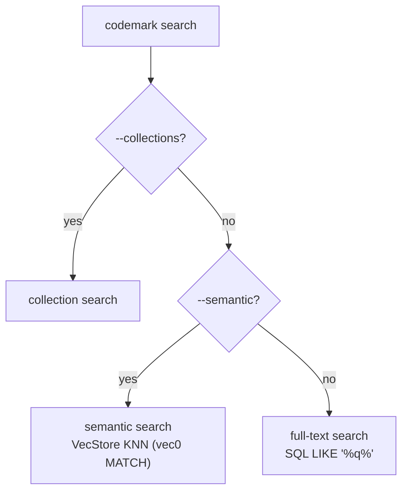

# Semantic Search & Embeddings

Codemark has two search modes: **semantic** (find by meaning) and
**full-text** (find by substring). They are mutually exclusive — you pick one
per query. This page covers how both work in
`crates/codemark-core/src/embeddings/` and `storage/`.

## How the dispatch chooses

There is no hybrid/rank-fusion. The `--semantic` flag selects the path once.

## Full-text search

The default (non-semantic) path is **SQL `LIKE` substring matching**, not a
full-text index. `search_bookmarks` builds dynamic SQL with `LIKE '%query%'`
OR-joined across:

- `bookmark_annotations.notes`
- `bookmark_annotations.context`
- `bookmark_tags.tag`
- `bookmarks.file_path`

Results are ordered by `created_at DESC`. This keeps exact lookups fast and
predictable.

::: details What about the FTS5 table?
The schema contains a `bookmarks_fts` FTS5 table (created in early migrations),
but it is **not consulted** by the search command — the production path scans the
normalized tables directly with `LIKE`. It's effectively legacy.
:::

## Semantic search

Semantic search finds bookmarks by intent ("where is authentication handled?")
using **local vector embeddings** — no API key, no network call for inference.

### On-device embedding generation

Embeddings are generated 100% locally with [candle](https://github.com/huggingface/candle)
on **CPU only**. The pipeline is a BERT sentence embedder:

1. **Tokenize** the input text.
2. **BERT forward pass** → hidden states.
3. **Mean pooling** over the (attention-mask-weighted) sequence axis.
4. **L2 normalize** → a unit-length 384-dimensional vector.

The model is lazily loaded once and cached in memory; model weights are fetched
on first use from Hugging Face Hub and cached on disk.

### Models

| Model | ID | Dimensions |
|-------|----|-----------|
| `all-minilm-l6-v2` (default) | `sentence-transformers/all-MiniLM-L6-v2` | 384 |
| `bge-small-en-v1.5` | `BAAI/bge-small-en-v1.5` | 384 |

Both are 384-dimensional. The `vec0` virtual tables are created at `float[384]`.

### Vector storage

Vectors live in **sqlite-vec** `vec0` virtual tables
(`bookmark_embeddings`, `collection_embeddings`), loaded globally via
`sqlite3_auto_extension` when the database opens. Embeddings are stored as
little-endian f32 byte blobs. Re-indexing upserts atomically (delete + insert in
a single transaction).

### Distance metrics

sqlite-vec returns Euclidean L2 distance. Because embeddings are L2-normalized,
conversions to other metrics are exact and ranking-preserving:

| Metric | Conversion from L2 | Default threshold | Lower is better? |
|--------|--------------------|-------------------|------------------|
| `l2` (default) | identity | 1.3 | yes |
| `cosine` | L2²/2 (= 1 − cos similarity) | 0.85 | yes |
| `ip` (inner product) | 1 − L2²/2 (= cos similarity) | 0.15 | no (higher is better) |

When a threshold is set, the search fetches more candidates first, converts each
distance, filters by the threshold, then truncates to the limit.

## What gets embedded

The embedding text is enriched so semantic search matches structural intent, not
just free-text notes:

- **Bookmarks**: tags + first annotation's notes/context, then enriched with a
  tree-sitter query summary (`"Node Type: function"`, `"Node Target: validate_token"`).
- **Collections**: name + description + tags.

## Reindexing

`codemark reindex` rebuilds embeddings for all bookmarks (and optionally
collections). It's a **full re-embed**, not incremental — each row is
delete-then-inserted. Scope it with `--lang` or `--collection`.

When you create a bookmark or collection, an embedding is generated
**best-effort, fire-and-forget** — failures are swallowed so they never block the
creating operation.
