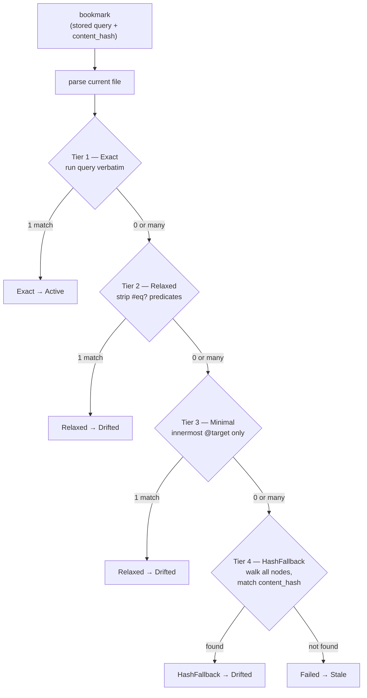

# Health Status & Resolution

Code moves. Every time you resolve or heal a bookmark, Codemark re-runs the
stored structural query against the *current* tree and computes a health status.
This page covers the tiered resolution pipeline in
`crates/codemark-core/src/engine/`.

## The status enums

There are two relevant enums:

- **`ResolutionMethod`** — *how* a match was found:
  `Exact | Relaxed | HashFallback | Failed`
- **`BookmarkHealth`** — the resulting state:
  `Active | Drifted | Stale | Archived`

(An additional UI-only `LiveUIStatus` — `Healthy | Drifted | Broken` — is used
for transient TUI previews.)

## The resolution pipeline

Resolution operates on a **single file**. There is no directory walk — cross-repo
concerns are handled at the database/registry layer, not the resolver.

### How each tier works

- **Tier 1 — Exact.** Run the stored `bookmark.query` verbatim. If it yields
  exactly one match, the method is `Exact`.
- **Tier 2 — Relaxed.** `relax_query` strips every `(#eq? …)`/`(#match? …)` text
  predicate via regex, keeping the structural nesting. This widens the match set
  (e.g. matches all methods in a class instead of one).
- **Tier 3 — Minimal.** `minimize_query` discards all ancestor structure and
  keeps only the innermost node pattern carrying `@target` plus its `@fn_name`
  predicate. Both Tier 2 and Tier 3 report as `Relaxed`.
- **Tier 4 — HashFallback.** Only when `bookmark.content_hash` is present. A
  recursive pre-order walk hashes every named node's source text and returns the
  first whose hash equals the stored one. This is how a bookmark survives a file
  rename or method extraction.

### A tier only fires if the previous one failed

Within a tier, if there are *multiple* matches and none of them hash-match the
stored content hash, the result is `None` — it falls through to the next tier
rather than guessing. This is the key correctness property: the resolver never
silently picks the wrong node.

## How health is computed

`health::transition()` is a **pure function of (method, hash_matches)** — time
parameters exist in the signature but are currently ignored:

| Method | hash_matches? | Resulting health |
|--------|---------------|------------------|
| `Exact` | yes | 🟢 `Active` |
| `Exact` | no (structure matched, content changed) | 🟡 `Drifted` |
| `Relaxed` | — | 🟡 `Drifted` |
| `HashFallback` | — | 🟡 `Drifted` |
| `Failed` | — | 🔴 `Stale` |

::: tip The query is never regenerated
`heal_bookmark` re-resolves using the *original* stored query and records a new
`Resolution` (new byte range, hash, location), but `Bookmark.query` is immutable
after creation. The tiered fallback is the entire drift-recovery mechanism; the
query is the durable anchor, resolutions are the moving history.
:::

## Where health physically lives

Health is **not** stored on the bookmarks table. The `resolutions` table holds
`health` and `method`; `bookmarks` only keeps a `current_resolution_id` pointer.
A bookmark's displayed health is its *current resolution's* health, fetched via a
join.

## The content hash

`content_hash` is `sha256:` + 16 hex chars, computed over whitespace-normalized
text:

1. Trim each line and collapse intra-line whitespace runs to a single space.
2. Collapse consecutive blank lines to one; drop leading/trailing blanks.
3. SHA-256 the result, take the first 8 bytes → 16 hex chars.

This normalization is exactly what lets a bookmark survive reformatting
(indentation changes, trailing whitespace, blank-line counts) while still
distinguishing different identifiers.

The hash is used three ways: disambiguating among multiple structural matches,
the Tier-4 fallback walk, and feeding the `hash_matches` flag into health
transitions.

## Heal vs. validate

`heal_bookmark` is the write path; `validate` runs the same resolution with no
database writes.

- **Heal** (1) checks a git-ancestry gate — it won't heal "backward" in history
  unless forced; (2) resolves; (3) computes health; (4) optionally auto-archives
  stale bookmarks; (5) inserts a deduplicated `Resolution` row and repoints the
  bookmark; (6) recomputes the health of every collection containing it.
- **Validate** (`--validate-only`) skips all writes but still reports the method,
  health, and location — a dry run.

Resolution history is capped (default 20 entries per bookmark) and deduplicated:
re-healing at the same location across unrelated commits updates the existing row
rather than creating noise.

## Collection health

A collection's health is the worst of its bookmarks:
`stale > drifted > active`, with `archived` bookmarks excluded. The TUI computes
this live for previews; the database stores a cached value.
