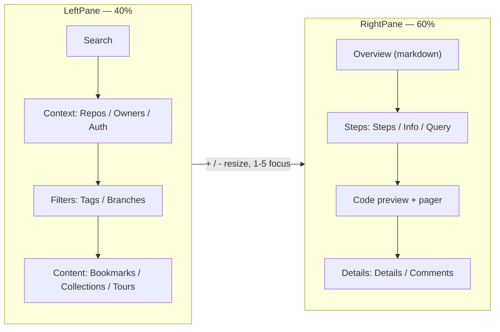

# Keybindings & the Dashboard

Codemark ships a native, keyboard-driven dashboard (`codemark tui`) in the style
of `lazygit`. It's a two-pane browser: a **left sidebar** (40%) with search,
context, filters, and content; and a **right main pane** (60%) with an overview,
steps, a code preview, and details.

> Requires a [Nerd Font](https://www.nerdfonts.com/) — the dashboard uses glyph
> icons throughout.

## Layout

Each pane is a `TabbedPanel`; switch its tabs with `[` / `]`. The left content
panel has three tabs (Bookmarks / Collections / Tours); the right has a steps
panel (Steps / Info / Query) and a details panel (Details / Comments).

## Global keys

These work from anywhere (except while typing in the search bar, unless noted):

| Key | Action |
|-----|--------|
| `1`–`5` | Jump to pane (matches the `[N]` border badge) |
| `Tab` / `Shift+Tab` | Cycle focus between panes |
| `[` / `]` | Previous / next tab within the focused panel |
| `+` / `=` | Grow the focused pane |
| `-` / `_` | Shrink the focused pane |
| `q` | Quit |
| `Ctrl+C` | Quit from anywhere (lazygit-style) |
| `Esc` | Back / cancel / clear search / clear filter |
| `?` | Toggle the context-aware keybindings help overlay |
| `,` | Toggle the settings overlay |
| `s` | Focus the search bar |
| `/` | Enter filter mode |

## Content & action keys

| Key | Action |
|-----|--------|
| `Enter` | Activate / open the selected item |
| `Space` | Toggle selection (no focus move) |
| `o` | Open the selected bookmark in your configured editor |
| `Ctrl+O` | Copy bookmark ID (in Content) / copy markdown (in Info) |
| `H` | Heal — all bookmarks in the list (Content) / the current one (Main) |
| `d` | Delete (with a confirm dialog) |
| `S` | Cycle sort order (Bookmarks / Collections) |
| `p` | Pull a remote tour / refresh |
| `P` | Push collections to a remote `codetours` server (when logged in) |

## Vim motions (delegated to child panes)

| Key | Where | Action |
|-----|-------|--------|
| `j` / `↓` | lists, code, markdown | Move down (wraps) |
| `k` / `↑` | lists, code, markdown | Move up (wraps) |
| `J` / `K` | global | Scroll the visible preview by 5 lines |
| `h` / `←` | right pane | Previous step in a collection |
| `l` / `→` | right pane | Next step in a collection |
| `n` / `N` | markdown | Focus next / previous link |
| `Enter` | markdown | Open the focused link |

::: tip No `gg` / `G` / `Ctrl-d` / `Ctrl-u`
The motion set is intentionally small: `j`/`k`/`J`/`K` plus the step nav
`h`/`l`. Capital `J`/`K` scroll the preview so they never collide with lowercase
list navigation.
:::

## Search

Press `s` (or `Enter` in the search bar) to search. The search bar shows a
`[ FTS | Sem ]` segmented control. Toggle modes with `Ctrl+S` (semantic builds
only). A Braille spinner indicates while semantic search runs; results are
capped at 20.

- **FTS** — substring search across notes, context, tags, and file paths.
- **Sem** — semantic search by meaning (local vector embeddings).

`Esc` clears the query and drops any in-flight results.

## Overlays

- **`?` Help** — a context-aware cheat-sheet of the keys relevant to your current
  focus, with priority bands (pinned actions always show).
- **`,` Settings** — a modal with three tabs: **Configuration** (paths, db,
  model, theme), **Theme** (live-preview and persist), and **About**. Navigate
  with `j`/`k`, switch tabs with `[`/`]`, save with `Enter`, close with `Esc` or
  `,` (closing without saving reverts the theme).

## Mouse support

Click to focus and select list items; scroll to navigate panes. Confirm dialogs
(`d` deletes) also respond to mouse.
