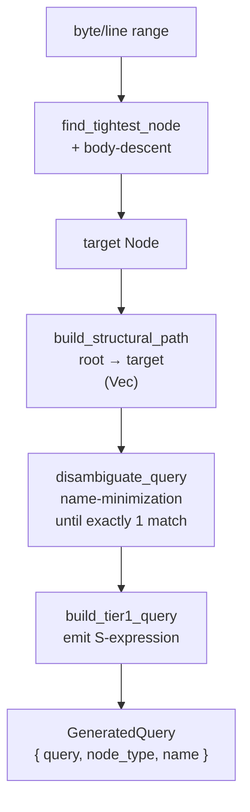

# Query Generation

When you bookmark a range, Codemark must produce a tree-sitter query that
uniquely identifies that code so it can be found again later — even after the
surrounding code changes. This page walks through the real pipeline in
`crates/codemark-core/src/query/generator.rs`.

::: tip The query is the durable identity
A bookmark's query is generated **once** at creation and **never rewritten**
after drift. The tiered fallback at resolution time (relax → minimize → hash) is
the entire recovery mechanism. The query is the anchor; resolutions are the
moving history.
:::

## The pipeline



## Step 1 — Snapping to the target node

There is no "snap up to the enclosing declaration". Instead, two mechanisms
combine:

1. **`find_tightest_node`** — for a point range it finds the deepest named node
   at the point; for a multi-byte range it finds the smallest named node covering
   the range. Anonymous nodes (like `(`) are skipped.
2. **Body-descent loop** — while the node is a *body node* (`block`,
   `declaration_list`, `class_body`, `statement_block`, …), it descends into the
   first named child overlapping the range. It stops as soon as a node carries
   semantic info.

So a single line inside a method body targets the tightest node (a `block`),
**not** the enclosing `function_item`. The function still appears in the
bookmark — as a *landmark ancestor* in the structural path, where it gets named.

## Landmarks vs. sticky captures — two different things

These are easy to confuse but are distinct concepts:

- **Landmarks** drive *query anchoring*. `is_landmark_kind(kind)` is true when a
  node type is in the language `Profile::landmark_kinds` (or the
  `DECLARATION_TYPES` fallback). Only landmark ancestors are eligible to be
  named during disambiguation — this is what makes queries stable across
  refactors.
- **Sticky captures** (`@sticky.class`, `@sticky.function`) are *UI tags* emitted
  on the same nodes that landmarks name. They're collected at match time to build
  human-readable breadcrumbs ("in `AuthService.validateToken`"). They don't
  affect anchoring.

## Step 2 — Building the structural path

`build_structural_path` walks from the target up to (excluding) the root,
building a `Vec<PathEntry>` (outermost first):

| Field | Meaning |
|-------|---------|
| `node_type` | The tree-sitter kind. |
| `name_info` | The node's name (if it has a nameable field), forced to `None` on body nodes. |
| `is_landmark` | Whether this ancestor is an eligible anchor. |
| `sticky_tag` | The `@sticky.<category>` tag, if any. |

Two rules keep the path clean:
- **Wrapper nodes** (`export_statement`, `decorated_definition`) are *skipped* —
  they have no queryable name.
- **Local declarations** inside functions are *demoted* to non-landmark, so a
  local variable isn't mistaken for an anchor.

## Step 3 — Disambiguation (the real "compaction")

The query is built from the path, then made unique by a **name-minimization
search** in `disambiguate_query`. It strips *all* names, keeps only the target's
semantic info, then progressively re-adds names until the compiled query matches
exactly **one** node (verified by compiling and running it):

1. Name only the target. Accept if exactly 1 match (and a named landmark exists,
   or depth is 1).
2. Walk ancestors; restore each landmark ancestor's name; accept on first unique
   match.
3. Restore *all* ancestor names.
4. Fully unnamed path.
5. Else error `AmbiguousQuery`.

So "compaction" really means: **drop names on non-landmark ancestors and keep
the fewest named landmarks that still disambiguate.** Body nodes contribute only
their type for nesting — never a name.

## Step 4 — Emitting the query string

`build_tier1_query` produces the tree-sitter S-expression. Conventions:

- The target's name capture is always `@fn_name`; ancestors are `@name0`,
  `@name1`, …
- Named landmarks additionally get a `@sticky.<category>` on the same node.
- The target node always gets `@target` appended.
- Names are enforced with `(#eq? @capture "name")` predicates.

### Example: a Swift method in a class

For `validateToken` inside `class AuthService`, the generator produces:

```scheme
(class_declaration
  name: (type_identifier) @name0 @sticky.class
  (#eq? @name0 "AuthService")
  (class_body
    (function_declaration
      name: (simple_identifier) @fn_name @sticky.function
      (#eq? @fn_name "validateToken")) @target))
```

A top-level Rust function with no ancestors is just:

```scheme
(function_item name: (identifier) @fn_name (#eq? @fn_name "create_default_auth_service")) @target
```

## Fine-grained targets with SemanticInfo

Statements without a name field — two `if` statements, two `return`s — can't be
disambiguated by a name. For these, `extract_semantic_info` captures
distinguishing content:

| Variant | What it captures |
|---------|------------------|
| `IfCondition` | The condition being tested |
| `CallTarget` | The function being called |
| `AssignmentTarget` | The variable being assigned |
| `ReturnValue` | The value being returned |

These emit field-scoped captures (`condition: (_) @cond`, etc.) with their own
`#eq?` predicates, so otherwise-identical statements become uniquely
targetable.

## Degradation tiers (applied at resolution, not creation)

When a bookmark is re-resolved and the Tier-1 query no longer matches, the
resolver degrades it rather than rewriting it:

| Tier | Operation | Effect |
|------|-----------|--------|
| Tier 2 — `relax_query` | Strips every `#eq?`/`#match?` predicate | Matches by structure only (all methods in a class) |
| Tier 3 — `minimize_query` | Keeps only the innermost `@target` pattern + its name predicate | Drops all ancestors |

See [Health Status](./health-status) for how these tiers drive bookmark health.
