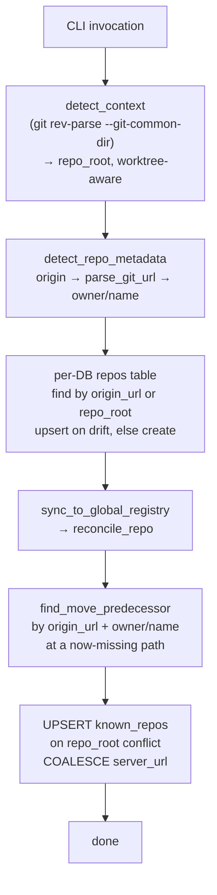

# Repository Registry & Worktrees

Codemark is **Git-aware by default**. It detects the current repository, tracks
bookmarks by a durable identity, and supports multi-repo queries. This page
covers how repos are registered and discovered, in
`crates/codemark-core/src/storage/registry.rs`, `workspace.rs`, and
`git/context.rs`.

## Two-tier registry model

Codemark tracks repositories at two levels:

| Tier | Location | Key | Purpose |
|------|----------|-----|---------|
| **Per-repo DB** | `<repo_root>/.codemark/codemark.db` → `repos` table | `origin_url` AND `repo_root` (both unique) | Each repo worked in is a row here; bookmarks reference `repo_id`. |
| **Global registry** | data dir → `registry.db` → `known_repos` table | `repo_root` (unique) | Cross-repo discovery and identity-by-name. |

The split is deliberate: the global registry recognizes a *moved* repo by its
durable `(repo_owner, repo_name)` identity rather than by the per-DB `id` (a
`Uuid::new_v4()` regenerated whenever `.codemark/` is recreated).

## How a repo is identified

`detect_repo_metadata` resolves a working directory to an identity:

1. **`git rev-parse --git-common-dir`** → its parent is the repo root. This is
   *worktree-aware*: every linked worktree shares the main repo's `.git`, so all
   worktrees resolve to the **same repo root** and share the same database.
2. **`git remote get-url origin`** → the origin URL.
3. **`parse_git_url`** strips `.git`, handles SSH (`git@host:path`) and
   https/http/ssh schemes, and takes the last two path segments as
   `owner/name` (handling GitLab subgroups).

Local repos with no origin get `None` for their identity and are tracked by
`repo_root` alone.

## Registration & reconciliation

Every CLI invocation needing repo metadata runs `resolve_or_create_repo_metadata`,
which reconciles both tiers:



`reconcile_repo` is transactional and smart about moves: if it finds a row with
the same `origin_url` + `(repo_owner, repo_name)` at a path that no longer exists
on disk, it treats it as a move — inherits its `server_url`/`default_username`,
deletes the predecessor, and upserts at the new path. Sync never auto-prunes (a
missing path might be a temporarily unmounted volume); `codemark repo prune` is
opt-in.

## Multi-repo queries

Two flags widen the scope of any command, repeatable:

| Flag | Mode | Behavior |
|------|------|----------|
| `--db <path>` | **Override** (if non-empty and not just primary) | Use only those database paths. |
| `--repo owner/name` | **Identity** | Resolve via the global registry → open `<repo_root>/.codemark/codemark.db`. |
| `[databases].additional` | **Additive** | From `.codemark/config.toml`: the primary ("local") plus these extra paths. |

```bash
# Query across multiple repositories by identity
codemark list --repo facebook/react --repo acme/api

# Combine with filters
codemark search "authentication" --repo facebook/react --health active
```

Additional databases are **read-only** — write operations affect only the primary
DB.

## Git worktrees

Because worktrees share the main repo's `.git` (detected via
`--git-common-dir`), they all resolve to the same repo root and therefore the
same `.codemark/codemark.db`. Your bookmarks are accessible from any worktree of
the same repository without duplication.

## The `codemark repo` commands

| Command | Effect |
|---------|--------|
| `repo list` | List all known repositories in the global registry. |
| `repo show [owner/name]` | Show details for a repository (defaults to current). |
| `repo set-server <url>` | Set the default sync server URL for a repository. |
| `repo sync` | Re-reconcile the current path — the "I moved the repo" repair command. |
| `repo prune [--dry-run]` | Remove entries whose `repo_root` no longer exists. |
