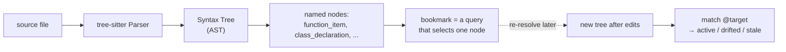

# Tree-sitter & Syntax Trees

Codemark doesn't store line numbers. It stores a **tree-sitter query** that
identifies code by its position in the Abstract Syntax Tree (AST). This page
covers how source is parsed into a tree; the next page covers how a bookmark
target becomes a query.

## Why tree-sitter?

A `file:42` reference is brittle — insert a single line above it and it now
points at the wrong code. Tree-sitter parses source into a concrete syntax tree
where every node has a *type* (`function_item`, `class_declaration`,
`if_statement`) and most have a *name* (`validate_token`, `AuthService`).
Anchoring a bookmark to "the function named `validate_token`" survives anything
that doesn't rename the function, because the *identity* of the node is what's
recorded, not its coordinates.

Tree-sitter is also fast and incremental, so re-parsing a file to resolve a
bookmark takes milliseconds.

## Two-tier language model

Codemark knows languages two ways:

- **Built-in languages** are statically compiled into the binary:
  `tree_sitter_rust`, `tree_sitter_swift`, `tree_sitter_typescript`, … These are
  always available and always win — a built-in name or extension can never be
  shadowed by a dynamic grammar.
- **Dynamic (WASM) grammars** are loaded at runtime from a cache directory. You
  drop a `grammar.wasm` + `manifest.json` into the grammar cache and Codemark
  understands a new language with no recompilation. See
  [Dynamic Grammars](./dynamic-grammars).

## The per-language Profile

Every language carries a **`Profile`** — structural metadata that drives query
generation, classification, and breadcrumbs. It has three parts:

| Field | Purpose |
|-------|---------|
| `landmark_kinds` | Which node types are valid query anchors (e.g. `function_item`, `struct_item`, `impl_item`). This is the load-bearing field for query stability. |
| `node_labels` | Maps raw node types to human labels (`function_item` → "function"), driving icons and summaries. |
| `containers` | `(node_kind, name_field)` pairs for UI breadcrumb extraction (e.g. `("impl_item", "type")`). |

Built-in languages have compile-time profiles; dynamic grammars load their
profile from `manifest.json` (every field is `#[serde(default)]`, so partial
profiles work). If a profile omits a kind, a cross-language `DECLARATION_TYPES`
fallback union covers it.

## What gets parsed and when

- **At bookmark creation**, the file is parsed and the generator builds a query
  (see [Query Generation](./query-generation)).
- **At resolution**, the file is re-parsed fresh and the stored query is run
  against the current tree (see [Health Status](./health-status)).
- **In the TUI**, a background parse cache (`HashMap<Language, ParseCache>`)
  feeds code previews with debouncing so stepping through a collection stays
  responsive.

Because the query is the durable identity and the tree is rebuilt each time,
edits that move code around don't invalidate the bookmark — they just change
which node the query matches.
