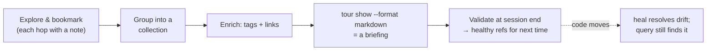

# Workflows

Codemark shines when the bookmarks you build in one session are still useful in
the next. These three workflows cover the most common ways to use it day to day.

## 1. Giving agents context

Instead of letting an agent re-explore the codebase from scratch each session,
curate a collection once and load it on demand.

```bash
# Build a guided tour of a request flow
codemark add --file src/router.rs --range 42 \
  --note "HTTP entry point — all requests route through here" \
  --tag feature:routing --tag role:entrypoint \
  --collection request-lifecycle --created-by claude

codemark add --file src/middleware/auth.rs --range 18 \
  --note "Verifies JWT signature and expiry before handlers run" \
  --tag feature:auth --tag role:middleware \
  --collection request-lifecycle --created-by claude

codemark add --file src/db/query.rs --range 7 \
  --note "Parameterized query builder — used by every service" \
  --tag layer:data --tag role:repository \
  --collection request-lifecycle --created-by claude
```

Then, in any later session — even after the code has moved:

```bash
# Load the whole tour as markdown: description, tags, links, steps + notes
codemark tour show request-lifecycle --format markdown
```

::: tip Notes vs. comments
Use `--note` for **durable** explanations of what the code is (reusable across
any session). Use `--comment` for **markdown** discussion tied to a task, ticket,
or PR ("investigating TOKEN-42, see PR #116"). Keeping them separate keeps notes
clean and reusable. See the [Agent Skill](./agent-skills) page.
:::

## 2. Distilling agent discoveries

When an agent explores and finds load-bearing code, capture it before the
knowledge evaporates. The bookmark should explain *why* the code matters, not
just *where* it is.

```bash
# A good note explains the role and relationships
codemark add --file src/auth.rs --range 42 \
  --note "Core auth validator. Entry point for all signed requests." \
  --note "Relationships: depends on the Claims struct." \
  --note "Performance: O(1) cache hit rate." \
  --tag feature:auth --tag role:entrypoint --tag layer:business
```

Repeated `--note` flags create separate annotation entries, so you can layer
behavior, performance, and security observations independently — and add more
later without editing prior notes:

```bash
codemark edit <id> --note "Discovered during debugging: race on token refresh"
```

At session end, validate so the next session starts with accurate references:

```bash
codemark health check --auto-archive
```

## 3. Onboarding

A collection is a guided tour you can hand to a new engineer (or a new agent):

```bash
codemark tour create onboarding --description "How a request flows through this service"
codemark tour add onboarding <id_handler> <id_middleware> <id_service> <id_db>

# Optional: make it a self-contained briefing
codemark tour link add onboarding --url "https://github.com/org/repo/wiki/Architecture" \
  --label "Architecture doc" --kind doc
```

Then they run:

```bash
codemark tour show onboarding --format markdown
```

… and get an ordered walkthrough in the order the code actually runs. Because the
bookmarks are structural, the tour still resolves after the codebase evolves —
drifted bookmarks point at where the code moved to, and stale ones flag
themselves for repair.



## Checking impact after changes

```bash
# Which bookmarks are affected by recent commits?
codemark tour diff --since HEAD~3

# Validate everything is still healthy
codemark health check
```

For a full end-to-end example across multiple sessions — including how Codemark
handles renamed files and extracted methods — see the
[Agent Walkthrough](./agent-workflow-walkthrough).
